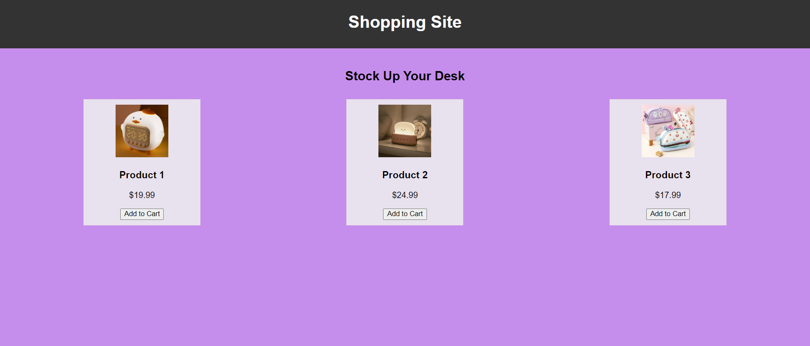

# landing page - TechnoHacks

## Aim 
create a basic landing page for a company or product that includes a header,fotter,and some basic information.

## Program 
landing.html
```
<!DOCTYPE html>
<html lang="en">
<head>
    <meta charset="UTF-8">
    <meta name="viewport" content="width=device-width, initial-scale=1.0">
    <title>Shopping Site</title>
    <link rel="stylesheet" href="style.css">
</head>
<body>
    <header>
        <h1>Shopping Site</h1>
    </header>

    <section>
        <h2>Stock Up Your Desk</h2>
        <div id="products">
            <div class="product">
                
                <h3>Product 1</h3>
                <p>$19.99</p>
                <button onclick="addToCart('Product 1', 19.99)">Add to Cart</button>
            </div>

            <div class="product">
                
                <h3>Product 2</h3>
                <p>$24.99</p>
                <button onclick="addToCart('Product 2', 24.99)">Add to Cart</button>
            </div>

            <div class="product">
                
                <h3>Product 3</h3>
                <p>$17.99</p>
                <button onclick="addToCart('Product 3', 17.99)">Add to Cart</button>
            </div>

            <!-- Add more products as needed -->
        </div>
    </section>

    <footer>
        <p>&copy; 2023 Shopping Site. All rights reserved.</p>
    </footer>

    <script src="script.js"></script>
</body>
</html>
```
style.css
```
body {
    font-family: 'Arial', sans-serif;
    margin: 0;
    padding: 0;
    background-color: 	#c68eec;
}

header {
    background-color: #333;
    color: #fff;
    padding: 10px;
    text-align: center;
}

section {
    padding: 20px;
    text-align: center;
}

#products {
    display: flex;
    justify-content: space-around;
    flex-wrap: wrap;
}

.product {
    background-color: rgba(234, 229, 238, 0.953);
    border: 1px solid #e9e2e2;
    padding: 10px;
    margin: 10px;
    width: 200px;
}

footer {
    background-color: #333;
    color: #fff;
    text-align: center;
    padding: 10px;
    position: fixed;
    bottom: 0;
    width: 100%;
}
```
script.js
```
function addToCart(productName, price) {
    alert(`Added ${productName} to cart. Total: $${price}`);
}
```
## Output

